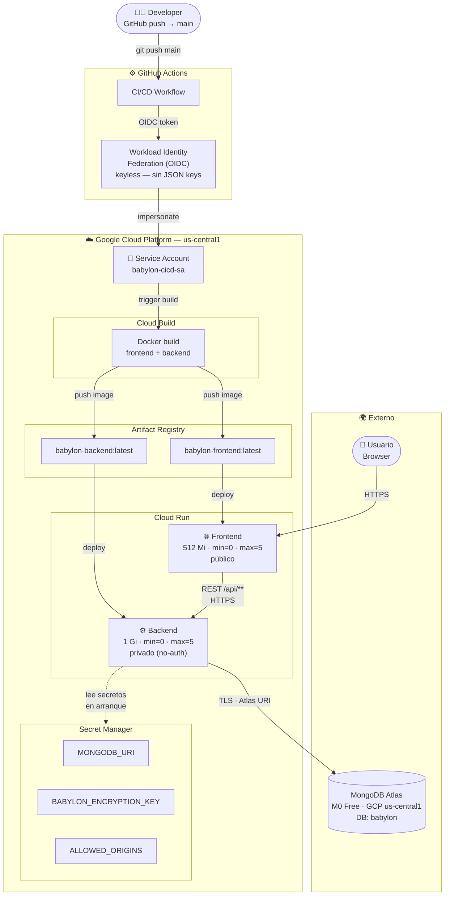

# Babylon Custom Insurance

Plataforma de seguros de vida modulares B2B2C.

## Stack

- **Frontend**: Vite + React 18
- **Backend**: Java 23 + Spring Boot 4.0.3 + WebFlux + MongoDB Reactive
- **Base de datos**: MongoDB Atlas M0
- **Deploy**: GCP Cloud Run + GitHub Actions

## Estructura

```
babylon-insurance/
├── frontend/     → React SPA (Vite)
├── backend/      → Spring Boot WebFlux (Arquitectura Hexagonal)
├── tests/        → Playwright E2E (36 tests contra producción)
└── .github/      → CI/CD Pipeline
```

## Levantar localmente

### Backend

```bash
cd backend
./mvnw spring-boot:run
```

### Frontend

```bash
cd frontend
npm install
npm run dev
```

## Variables de entorno requeridas

### Backend (`backend/.env`)

```
MONGODB_URI=mongodb://localhost:27017/babylon
BABYLON_ENCRYPTION_KEY=<base64 de 32 bytes — generar con: node scripts/generate-key.js>
ALLOWED_ORIGINS=http://localhost:3000
```

### Frontend (`frontend/.env`)

```
VITE_API_URL=http://localhost:8080
```

## Tests E2E (Playwright)

Los tests corren contra el entorno de producción en Cloud Run.

### Instalación (una vez)

```bash
cd tests
npm install
npx playwright install chromium
```

### Ejecutar

```bash
cd tests
npx playwright test              # headless — todos los tests
npx playwright test --headed     # con browser visible
npx playwright test --ui         # UI interactiva con timeline y screenshots
npx playwright test 03-beneficiaries  # suite específica
npx playwright show-report       # ver reporte HTML del último run
```

### Suites disponibles

| Suite | Descripción | Tests |
|-------|-------------|-------|
| `01-smoke` | Carga de app, título, catálogo completo | 3 |
| `02-modules` | Toggle módulos, selección de tier | 6 |
| `03-beneficiaries` | Agregar/quitar beneficiarios, validaciones, suma 100% | 8 |
| `04-assistances` | Límite por módulos activos, toggle | 4 |
| `05-holder-form` | Validaciones nombre, email, teléfono, edad | 7 |
| `06-cart-pricing` | Precios en tiempo real, descuento anual | 4 |
| `07-happy-path` | Flujo completo de cotización y pantalla de éxito | 4 |

> **Nota:** Cloud Run usa `min=0` — el primer test puede tardar ~25 s mientras el backend hace cold start.

## Arquitectura de Infraestructura (GCP)



---

## Gitflow

```
main
 └── feature/nombre-del-cambio   ← branch de trabajo
      └── PR → revisión → merge a main
```

Nunca commitear directamente a `main`.
